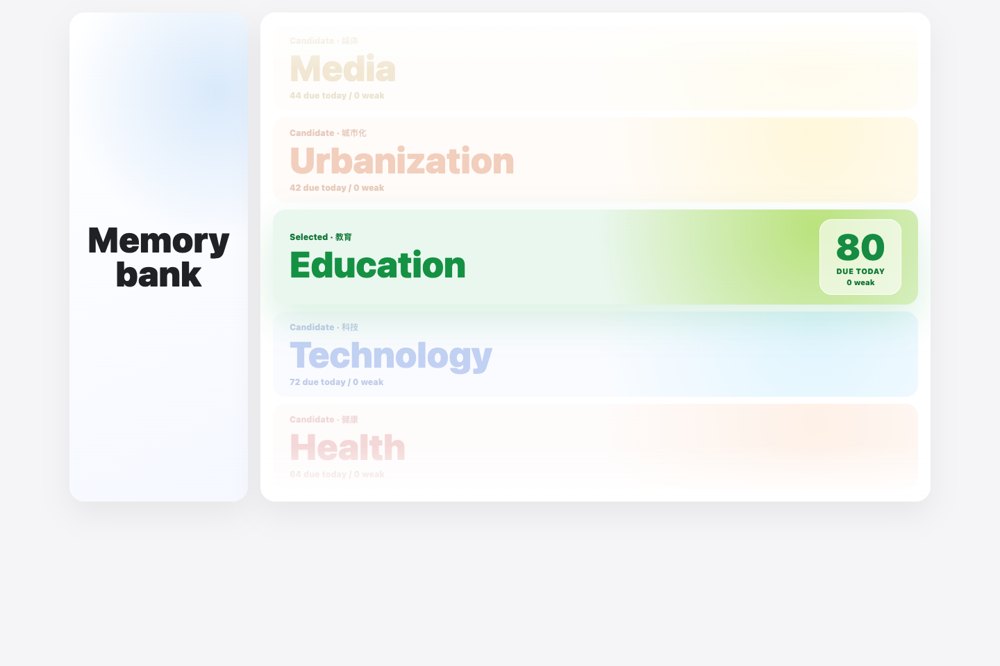
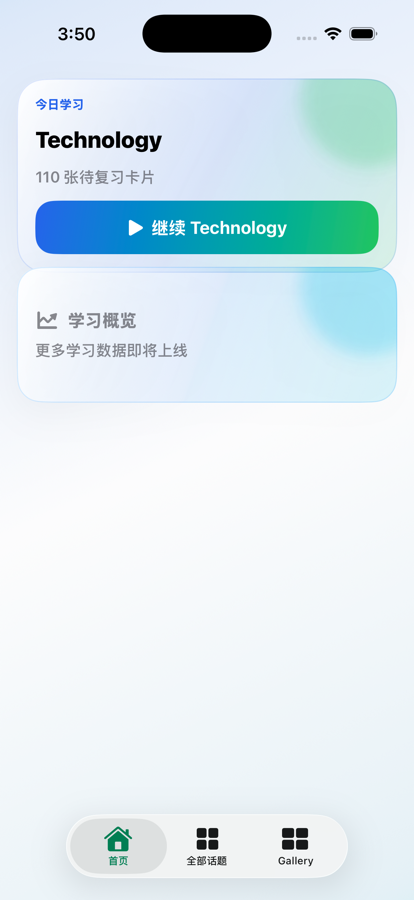
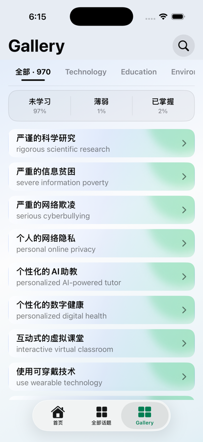
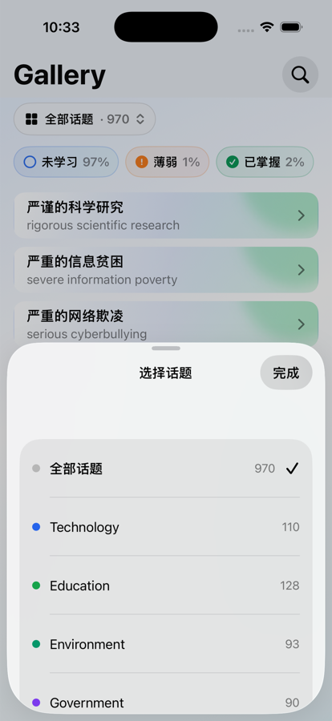
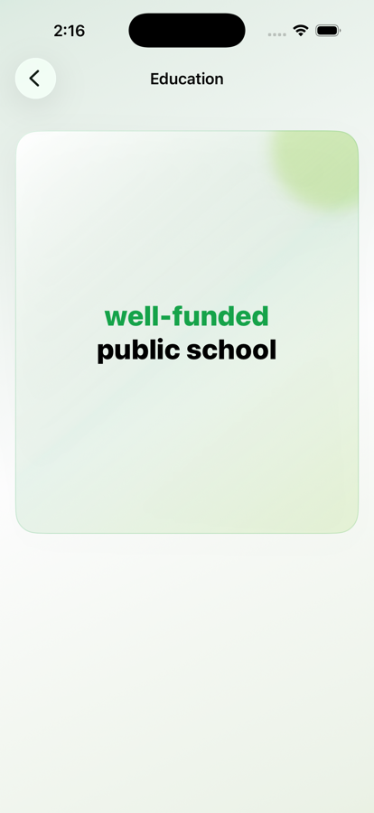

# IELTS Topic Collocation

面向 IELTS Writing Task 2 的话题搭配训练工具。现在项目已经按“用户可打开内容”和“工程/归档资料”分开整理。

## 直接打开

学习入口在：

```text
open-here/ielts-topic-collocation.html
```

这是单文件离线版本，可以直接用浏览器打开，不需要安装服务器，也不需要登录账号。



## iOS 原生 App

项目现在同时提供一套以 SwiftUI 编写的原生 iOS App。它沿用同一套 IELTS 话题搭配内容，但把学习流程整理成更适合手机使用的三栏导航：`首页`、`全部话题` 和 `Gallery`。

<p align="center">
  
</p>

### 当前体验

| 页面 | 主要用途 |
| --- | --- |
| 首页 | 查看今日待复习数量，并一键继续最近的话题学习。 |
| 全部话题 | 浏览 10 个 IELTS Writing Task 2 话题，进入对应的单卡学习流程。 |
| Gallery | 浏览全部 970 张搭配卡，按话题、`未学习`、`薄弱`、`已掌握` 筛选，也可以搜索中文或英文。 |
| 卡片详情 | 使用双语卡片复习表达；详情页保留统一的返回控件和底部导航。 |

<table>
  <tr>
    <td width="50%"><br><sub>Home：今日学习与 Continue 入口</sub></td>
    <td width="50%"><br><sub>Gallery：话题范围、记忆状态和双语卡片列表</sub></td>
  </tr>
  <tr>
    <td width="50%"><br><sub>话题选择器：一次打开即可访问全部话题</sub></td>
    <td width="50%"><br><sub>卡片详情：点击卡片查看英文并返回 Gallery</sub></td>
  </tr>
</table>

### Native App 的数据与状态

- 当前 bundle：`970` 张卡片、`10` 个话题、`1,487` 个 synonym options。
- 学习记录保存在设备本地，包括 review records、review log、标记卡片、最近话题和每日学习进度。
- 支持导出 / 导入 `topic-collocation-memory-v1` JSON，方便迁移学习状态。
- 内容入口是 `ios-app/IELTSCollocation/Resources/Content/ios-content.json`，由网页源数据生成。
- 当前 beta 不包含登录、云同步、支付或 IAP；Release / TestFlight 仍需要在 Xcode 中配置 Apple Developer signing。

### 在 Xcode 中运行

打开：

```text
ios-app/IELTSCollocation.xcodeproj
```

选择 `IELTSCollocation` scheme 和一个 iPhone Simulator 即可运行。刷新原生内容 bundle：

```bash
node web-source/scripts/export-ios-content.js
```

更多原生 App 的构建和 TestFlight 说明见 [`ios-app/README.md`](ios-app/README.md)。

## 推荐学习流程

1. 打开 `open-here/ielts-topic-collocation.html`。
2. 从 Topic Reel 选择一个写作话题。
3. 点击卡片，从中文提示回忆英文搭配。
4. 遇到不熟悉的表达，点击 `Mark` 加入 Memory bank。
5. 用 `Zen mode` 做集中回忆。
6. 需要迁移学习记录时，使用“导出记忆 / 导入记忆”。

## 话题范围

| 话题 | 中文 | 训练重点 |
| --- | --- | --- |
| Education | 教育 | 学校、课程、考试、学习方式 |
| Technology | 科技 | 自动化、数据、线上生活、工具使用 |
| Health | 健康 | 医疗、风险、恢复、生活方式 |
| Society | 社会 | 公平、家庭、身份、社会规范 |
| Government | 政府 | 政策、法律、公共服务、权利义务 |
| Environment | 环境 | 气候、资源、污染、可持续发展 |
| Economy | 经济 | 工作、市场、消费、贸易 |
| Media | 媒体 | 注意力、偏见、信息可信度 |
| Arts | 艺术 | 文化、表达、创意、审美价值 |
| Urbanization | 城市化 | 住房、交通、基础设施、城市生活 |

## 文件夹说明

| 文件夹 | 内容 |
| --- | --- |
| `open-here/` | 用户直接打开的离线学习工具 |
| `web-source/` | 网页源代码、生成脚本和浏览器检查脚本 |
| `project-docs/` | 项目文档、设计记录和 README 图片 |
| `project-artifacts/` | Anki 导出、视觉预览、截图和历史产物 |

## 重新生成离线 HTML

```bash
node web-source/build-standalone.js
```

生成后会更新：

```text
open-here/ielts-topic-collocation.html
```

## 自动检查

```bash
node web-source/qa-topic-header.js ../open-here/ielts-topic-collocation.html
node web-source/qa-advanced.js ../open-here/ielts-topic-collocation.html
```

或运行：

```bash
web-source/scripts/run-browser-checks.sh
```

检查内容包括话题导航、卡片翻面、Zen mode、搜索、同义替换面板和响应式页面。

## Anki 导出

Anki 相关文件已经归档到：

```text
project-artifacts/exports/anki/full-export/
```

其中 `topic-collocation-anki-all.tsv` 是全量导入文件，分话题 TSV 文件也保留在同一目录。
