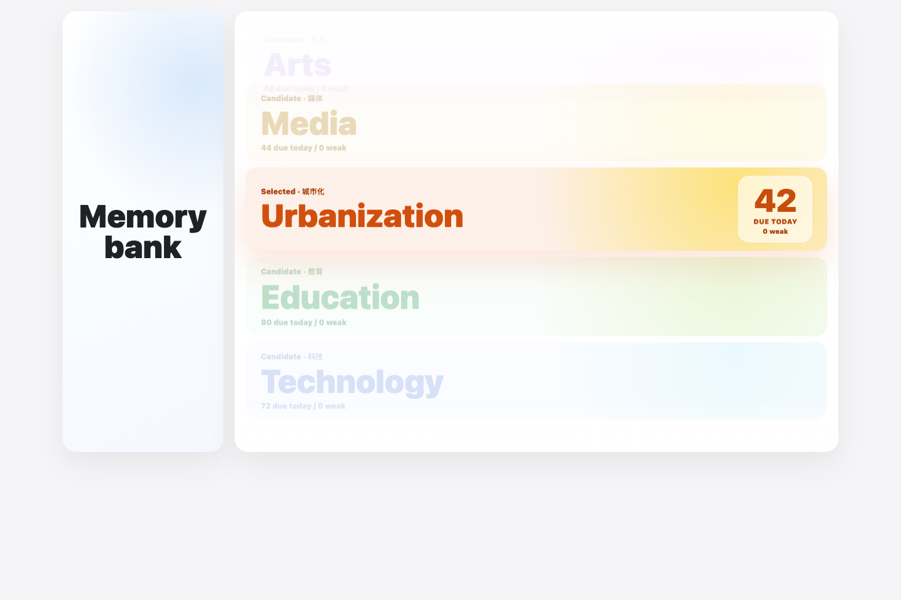
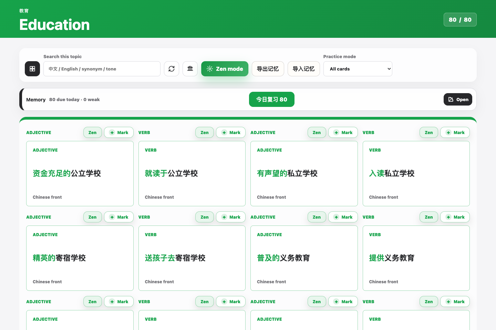
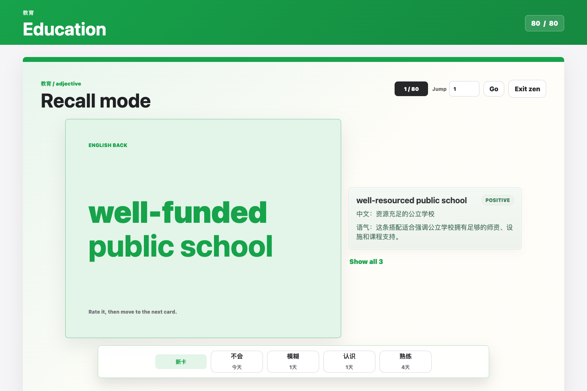
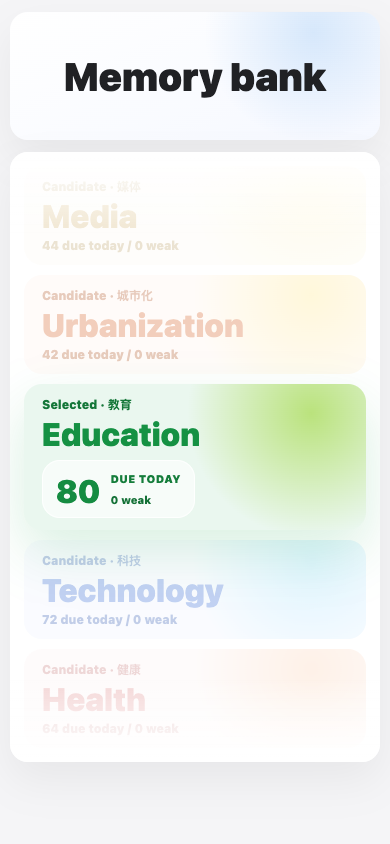

# IELTS Topic Collocation

面向 IELTS Writing Task 2 的话题搭配训练工具。当前成品入口是 `index.html`，可以直接在浏览器打开，用来做话题选择、搭配复习、Zen 专注回忆和薄弱表达管理。


## 这个工具解决什么问题

- 把 Task 2 高频话题拆成可复习的 collocation 卡片。
- 从中文提示回忆英文表达，减少“看得懂但写不出”的问题。
- 用 Topic Reel 在话题之间平滑切换，当前停留话题始终清楚。
- 用 Memory bank 收集薄弱搭配，后续集中复习。
- 用 Zen mode 做单卡片专注回忆，并按熟悉程度记录复习状态。
- 支持本地离线使用，适合课堂投屏、学生自练和快速分享。

## 成品预览

### 首页：Topic Reel

首页是一个轻量的话题选择器。左侧进入 Memory bank，右侧通过 Topic Reel 选择话题；切换时会沿着中间话题逐步过渡，而不是瞬间跳转。



### 学习页：按话题复习搭配

进入话题后，页面会显示该话题的全部卡片。可以搜索中文、英文、同义替换或语气标签，也可以直接进入 Zen mode。



### Zen mode：专注回忆

Zen mode 会把复习变成单卡片流程：先看中文提示，再翻面回忆英文表达，并根据掌握程度选择下一次复习间隔。



### 移动端

同一个 `index.html` 也适配手机屏幕，适合学生在课后继续复习。



## 推荐学习流程

1. 打开 `index.html`，先从 Topic Reel 选择一个写作话题。
2. 在学习页浏览卡片，点击卡片从中文翻到英文。
3. 遇到不熟悉的表达，点击 `Mark` 加入 Memory bank。
4. 点击 `Zen mode` 做集中回忆。
5. 复习完成后，通过 Memory bank 回看薄弱表达。
6. 需要迁移学习记录时，使用“导出记忆 / 导入记忆”。

## 话题范围

| 话题 | 中文 | 训练重点 |
| --- | --- | --- |
| Education | 教育 | 学校、课程、考试、学习方式 |
| Technology | 科技 | 自动化、数据、线上生活、工具使用 |
| Health | 健康 | 医疗、风险、恢复、生活方式 |
| Society | 社会 | 公平、家庭、身份、社会规范 |
| Government | 政府 | 政策、法律、公共服务、权利义务 |
| Environment | 环境 | 气候、资源、污染、可持续发展 |
| Economy | 经济 | 工作、市场、消费、贸易 |
| Media | 媒体 | 注意力、偏见、信息可信度 |
| Arts | 艺术 | 文化、表达、创意、审美价值 |
| Urbanization | 城市化 | 住房、交通、基础设施、城市生活 |

## 本地使用

直接打开：

```text
index.html
```

如果需要单文件离线版本，也可以打开：

```text
task2-collocation-flashcards-advanced-standalone.html
```

普通学习不需要安装服务器，也不需要登录账号。

## 重新生成单文件版本

```bash
node build-standalone.js
```

生成后会更新：

```text
task2-collocation-flashcards-advanced-standalone.html
```

## 自动检查

```bash
node qa-topic-header.js task2-collocation-flashcards-advanced-standalone.html
node qa-advanced.js task2-collocation-flashcards-advanced-standalone.html
```

检查内容包括话题导航、卡片翻面、Zen mode、搜索、同义替换面板和响应式页面。

## 主要文件

| 文件 | 作用 |
| --- | --- |
| `index.html` | 当前成品入口 |
| `styles.css` | 页面布局、颜色、响应式样式和动效 |
| `script.js` | 话题切换、卡片复习、Zen mode、Memory bank 逻辑 |
| `data.js` | Collocation 卡片数据 |
| `sentences.js` | 例句与扩展表达数据 |
| `build-standalone.js` | 生成单文件 HTML |
| `docs/images/` | README 使用的成品截图 |
| `app/` | Android 原生版本代码 |


