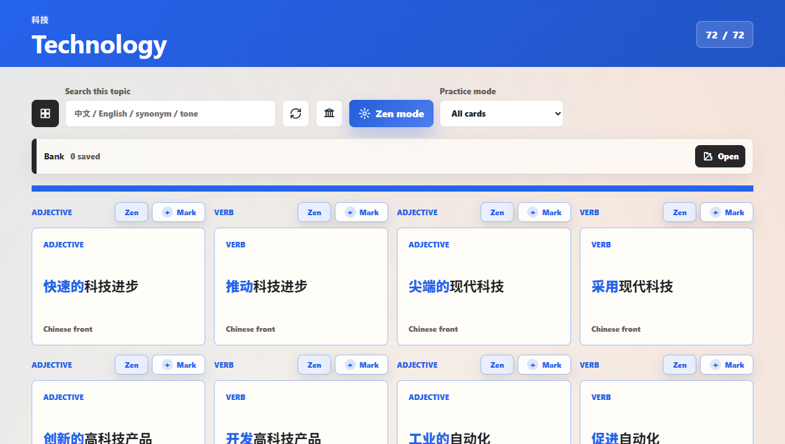
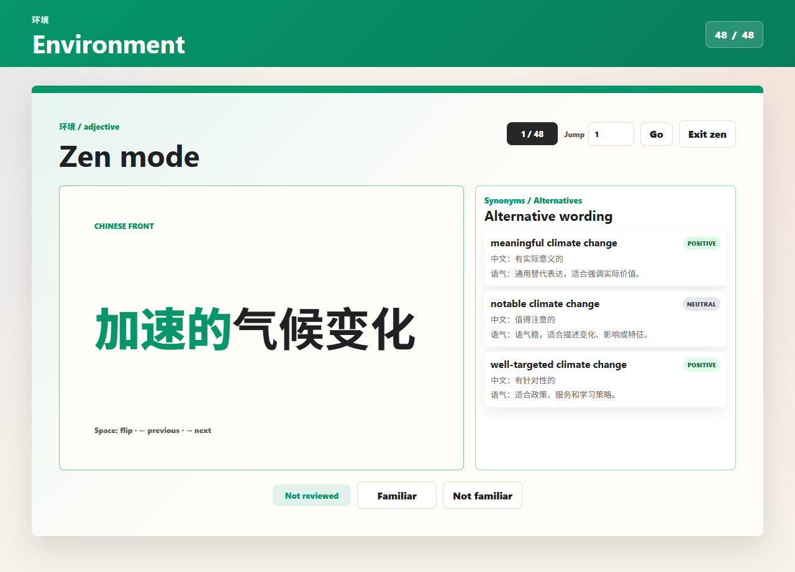
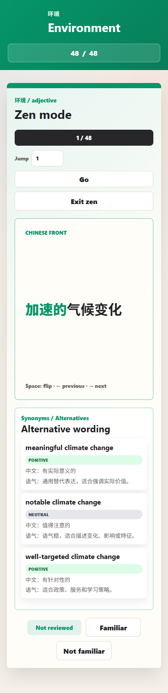

# IELTS Topic Collocation

An IELTS Writing Task 2 collocation flashcard tool for topic-based review, focused practice, and advanced wording upgrades.

The app is designed as a local-first study tool: students can open one standalone HTML file and practice without installing a server or signing in.



## Highlights

- 10 IELTS Writing Task 2 topic areas.
- Topic-colored study pages for fast visual orientation.
- Flip cards for Chinese-to-English collocation review.
- Zen mode for focused card-by-card practice.
- Start Zen mode from any specific card.
- Synonyms / alternatives panel for advanced wording.
- Familiar / Not familiar review tracking.
- Collocation bank for saved weak items.
- Search by Chinese, English, synonym, or tone.
- Standalone HTML build for offline classroom use.

## Study Flow

1. Choose a topic such as Technology, Education, Environment, or Society.
2. Review collocation flashcards by flipping each card.
3. Mark weak items into the collocation bank.
4. Start Zen mode from the current card when focused practice is needed.
5. Use the synonym panel to compare alternative expressions and tone.



## Topics

| Topic | Focus |
| --- | --- |
| Technology | interfaces, automation, data, modern life |
| Education | learning, exams, classrooms, growth |
| Environment | climate, resources, repair, sustainability |
| Government | policy, law, rights, public order |
| Society | family, fairness, norms, identity |
| Health | care, risk, recovery, wellbeing |
| Urbanization | housing, infrastructure, city life |
| Media | attention, bias, information, trust |
| Economy | jobs, markets, money, trade |
| Arts | culture, expression, imagination |

## Mobile Friendly

The interface is responsive, so the same standalone file can be used on laptops, classroom screens, or mobile devices.



## Use Locally

Open this file directly in a browser:

```text
task2-collocation-flashcards-advanced-standalone.html
```

No installation is required for ordinary study use.

## Project Structure

| File | Purpose |
| --- | --- |
| `index.html` | Source HTML entry |
| `styles.css` | App styling and responsive layout |
| `script.js` | App logic, study state, Zen mode, navigation |
| `data.js` | Flashcard data |
| `sentences.js` | Sentence data |
| `task2-collocation-flashcards-advanced-standalone.html` | Single-file local version |
| `build-standalone.js` | Rebuilds the standalone HTML |
| `qa-advanced.js` | Browser QA for main advanced flows |
| `qa-topic-header.js` | Browser QA for topic header and navigation |

## Rebuild Standalone

```bash
node build-standalone.js
```

## Run Checks

```bash
node qa-topic-header.js task2-collocation-flashcards-advanced-standalone.html
node qa-advanced.js task2-collocation-flashcards-advanced-standalone.html
```

The QA scripts use Playwright/Chrome to verify the topic header, topic navigation, Zen mode, synonym panel, search behavior, and responsive rendering.

## Repository

`IELTS-Topic-Collocation`
